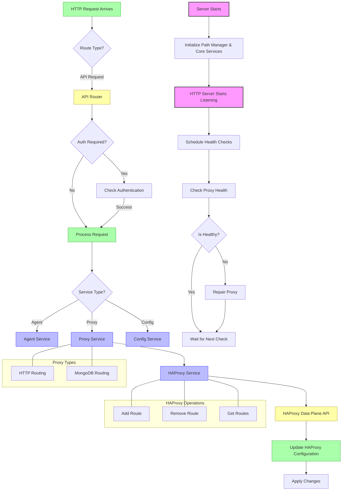

# CloudLunacy Front Server Architecture

This diagram explains how the CloudLunacy Front Server works, from initialization to handling proxy requests, using the HAProxy Data Plane API.

## How It Works (in Simple Terms)

### 1. Startup Process

- **Server Initialization**: The application starts, loads environment variables, and sets up express server
- **Services Initialization**: Core services are initialized in the right order (Config → HAProxy → Proxy → Agent)
- **Health Checks**: Regular checks ensure everything is running properly

### 2. Request Handling

- **Incoming Request**: When a request comes in, it goes through the API router
- **Authentication**: Most requests require authentication
- **Service Selection**: The request is directed to the appropriate service (Agent, Proxy, or Config)

### 3. Proxy Management

- **Proxy Service**: Handles routing requests to appropriate destinations
- **HAProxy Service**: Communicates with HAProxy using the Data Plane API
- **Route Types**: Supports both HTTP routing and MongoDB routing

### 4. HAProxy Data Plane API

- **Configuration Updates**: Changes to routes are sent through the API
- **Atomic Changes**: Uses transactions to ensure consistent configuration
- **Health Monitoring**: Ensures HAProxy is running correctly

### 5. Key Features

- **Dynamic Routing**: Add, remove, and modify routes without restarting
- **Authentication**: Secure API access
- **Health Repair**: Automatic detection and repair of configuration issues
- **Graceful Shutdown**: Handles termination signals appropriately

## Technical Components

| Component       | Purpose                                       |
| --------------- | --------------------------------------------- |
| Server.js       | Main entry point that starts everything       |
| Core Services   | Modular services for different functionality  |
| HAProxy Service | Manages HAProxy via Data Plane API            |
| Proxy Service   | High-level routing functionality              |
| Agent Service   | Manages agent registration and authentication |
| Config Service  | Handles configuration settings                |
