# CloudLunacy Data Flow

This diagram explains how data flows through the CloudLunacy Front Server when handling proxy requests.

```mermaid
flowchart LR
    %% External entities
    CLIENT[Client] <--> DOMAINS{Domain Type}
    DOMAINS -->|app.subdomain| HTTP_FRONT[HTTP Router]
    DOMAINS -->|mongodb.subdomain| MONGO_FRONT[MongoDB Router]

    %% Traefik
    subgraph TRAEFIK[Traefik]
        HTTP_FRONT --> ROUTER[Router Processing]
        MONGO_FRONT --> ROUTER
        ROUTER --> MATCHER{Rule Matching}
        MATCHER -->|Match Found| SERVICE_SELECT[Service Selection]
        SERVICE_SELECT --> SERVICES[(Configured Services)]
    end

    %% Backend targets
    SERVICES --> APP_SERVERS[Application Servers]
    SERVICES --> DB_SERVERS[Database Servers]

    %% Management flow
    ADMIN[Administrator] --> API_SERVER[API Server]
    API_SERVER --> PROXY_SERVICE[Proxy Service]
    PROXY_SERVICE --> TRAEFIK_SERVICE[Traefik Service]

    %% File provider
    TRAEFIK_SERVICE -->|File Updates| CONFIG_FILES[Dynamic Configuration Files]
    CONFIG_FILES --> TRAEFIK

    %% Agent registration
    AGENT[Agent VPS] --> REGISTER[Register]
    REGISTER --> AGENT_SERVICE[Agent Service]
    AGENT_SERVICE --> PROXY_SERVICE

    %% Styles
    classDef external fill:#ffd, stroke:#c80,stroke-width:1px;
    classDef internal fill:#ddf, stroke:#11f,stroke-width:1px;
    classDef config fill:#dfd, stroke:#080,stroke-width:1px;

    class CLIENT,ADMIN,AGENT,APP_SERVERS,DB_SERVERS external;
    class API_SERVER,PROXY_SERVICE,TRAEFIK_SERVICE,AGENT_SERVICE internal;
    class CONFIG_FILES,SERVICES config;
```

## Data Flow Explanation

### User Traffic Flow

1. **Client Request**:

   - A client makes a request to a subdomain (e.g., `app.cloudlunacy.uk` for HTTP or `mongodb.cloudlunacy.uk` for MongoDB)

2. **Traefik Processing**:

   - The request reaches Traefik routers (HTTP or MongoDB)
   - Traefik uses rule matchers to identify the correct service based on the domain
   - The request is forwarded to the appropriate backend server

3. **Backend Response**:
   - The backend application or database server processes the request
   - The response flows back through Traefik to the client

### Management Flow

1. **Administrator Actions**:

   - An administrator uses the API to manage routes

2. **API Processing**:

   - The API server validates the request and passes it to the Proxy Service
   - The Proxy Service coordinates with the Traefik Service

3. **Traefik Configuration**:
   - The Traefik Service updates the dynamic configuration files
   - Traefik automatically detects and applies configuration changes without disruption

### Agent Registration

1. **Agent Setup**:

   - A new Agent VPS registers itself with the CloudLunacy Front Server
   - The Agent Service validates the registration

2. **Route Creation**:
   - Upon successful registration, appropriate routes are created
   - The Traefik configuration is updated to include the new agent's endpoints

## Key Concepts

| Concept              | Description                                   |
| -------------------- | --------------------------------------------- |
| Routers              | Traefik entry points that listen for requests |
| Rule Matchers        | Rules that determine routing logic            |
| Services             | Destination services for forwarded requests   |
| Dynamic Config Files | YAML files for managing Traefik configuration |
| Agents               | Remote servers that register for routing      |
