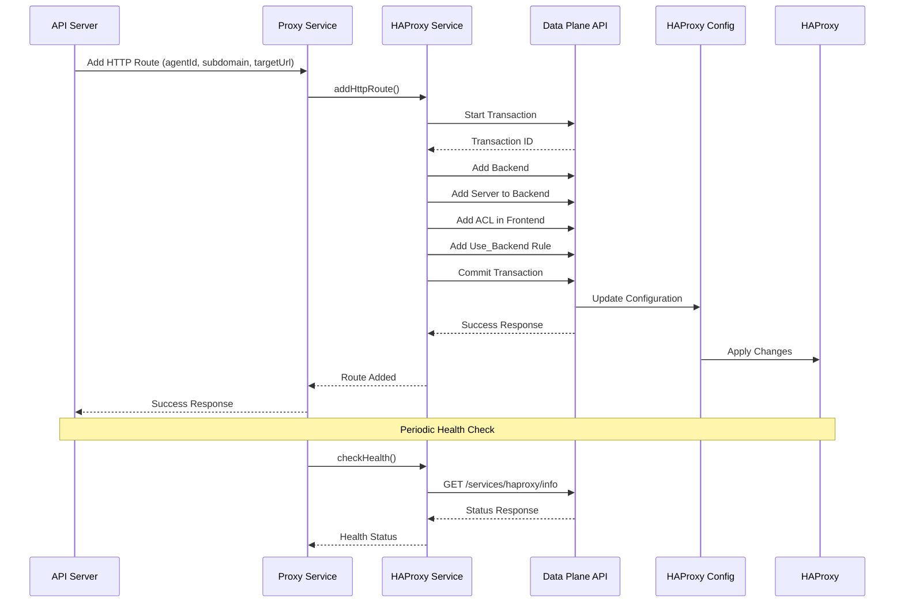

# HAProxy Data Plane API Integration

This diagram explains how the CloudLunacy Front Server integrates with HAProxy using the Data Plane API.

## HAProxy Data Plane API Integration Explained

### What is the HAProxy Data Plane API?

The HAProxy Data Plane API is an official API that allows programmatic management of HAProxy instances. It provides:

- A RESTful interface to query and modify HAProxy configurations
- Transaction support for atomic changes
- Runtime updates without service disruption
- Secure authentication

### How CloudLunacy Uses the Data Plane API

1. **Service Architecture**:

   - The `HAProxyService` acts as a client to the Data Plane API
   - It encapsulates all API calls and provides a simpler interface to other services

2. **Key Operations**:

   - **Adding Routes**: Creates backends, servers, and ACL rules
   - **Removing Routes**: Removes configuration elements safely
   - **Health Checks**: Verifies HAProxy is operational
   - **Configuration Management**: Handles transactions and atomic updates

3. **Transaction Model**:
   - Changes are grouped into transactions
   - All changes in a transaction are committed together
   - If any part fails, the entire transaction is rolled back

### Benefits of Using the Data Plane API

| Benefit         | Description                                                       |
| --------------- | ----------------------------------------------------------------- |
| Reliability     | Uses the official API rather than custom config file manipulation |
| Safety          | Changes are atomic and validated by HAProxy                       |
| Real-time       | Updates applied without restarting HAProxy                        |
| Maintainability | Standardized API calls instead of custom config parsing           |
| Monitoring      | Built-in health and status checks                                 |

### Example: Adding an HTTP Route

1. **API Request**: The system receives a request to add a new HTTP route
2. **Transaction Start**: A transaction is created to group all related changes
3. **Configuration Updates**:
   - Backend is created for the agent/subdomain
   - Server entry is added to the backend
   - ACL rule is added to match the subdomain
   - Use_backend rule links the ACL to the backend
4. **Transaction Commit**: All changes are applied atomically
5. **Verification**: The system confirms the changes were applied correctly
